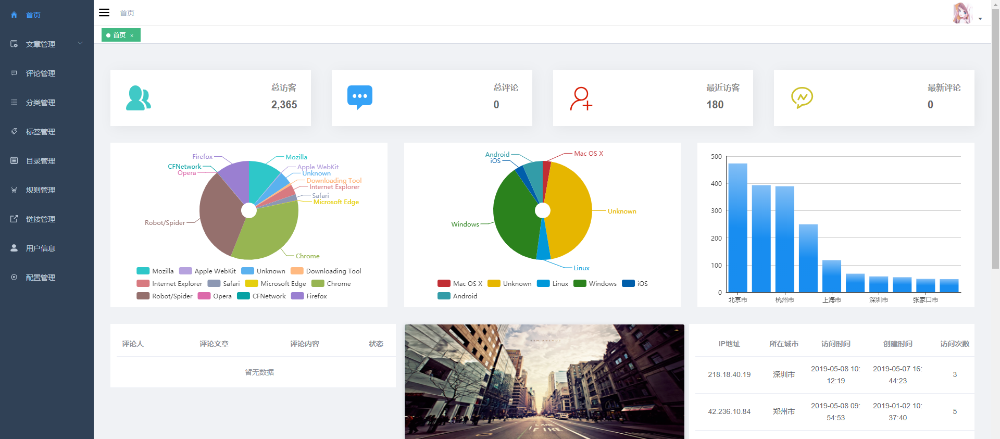
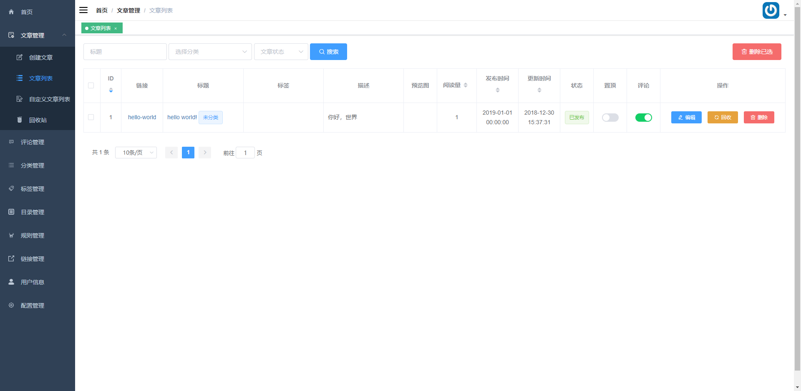
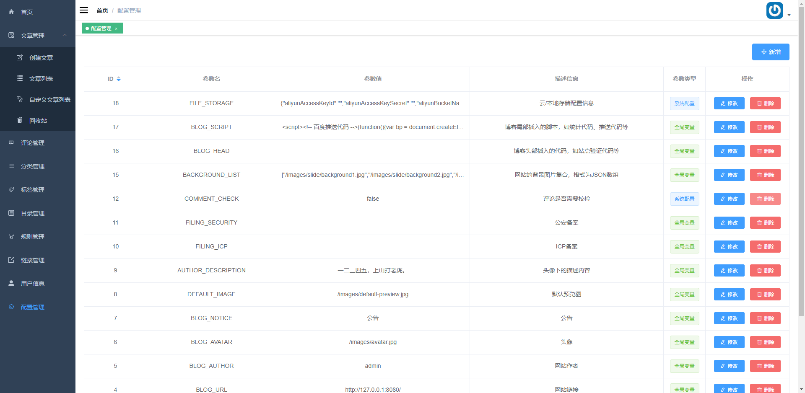

## 简介

[开源个人博客系统](https://github.com/iszhouhua/blog)的后台前端部分代码。项目基于 [vue](https://github.com/vuejs/vue) 和 [element](https://github.com/ElemeFE/element)，以[vue-admin-template](https://github.com/PanJiaChen/vue-admin-template)为模板完成开发。

## 开发

### sass

项目中用到了[sass](https://www.sass.hk/)，需要先安装相关依赖，如已安装，则可跳过。

`sass`基于`Ruby`语言开发而成，因此安装`sass`前需要[安装Ruby](http://rubyinstaller.org/downloads)。（注:mac下自带Ruby无需在安装Ruby!）

window下安装SASS首先需要安装`Ruby`，先从官网[下载Ruby](http://rubyinstaller.org/downloads)并安装。安装过程中请注意勾选`Add Ruby executables to your PATH`添加到系统环境变量。

```bash
# 查看ruby版本
ruby -v
```

### 运行

```bash
# 克隆项目
git clone https://github.com/iszhouhua/blog.git

# 进入项目目录
cd blog/vue

# 安装依赖
npm install --registry=https://registry.npm.taobao.org

# 启动服务
npm run dev
```

浏览器访问 <http://127.0.0.1:8888>

账号：admin

密码：123456

### gyp

安装过程中如果出现报`gyp ERR`错误，执行以下命令安装`python`环境即可。

```bash
npm install --global --production windows-build-tools
```

　此命令等于一键安装了以下三个软件：

1. [python](https://www.python.org/downloads/)(v2.7 ，3.x不支持);
2. [visual C++ Build Tools](https://www.microsoft.com/zh-CN/download/details.aspx?id=48159),或者 （[vs2015](https://www.visualstudio.com/vs/community/)以上（包含15))
3. .net framework 4.5.1

## 发布

> 将`prod.env.js`中的`BLOG_URL`改为自己的博客链接。

```bash
npm run build
```

将`dist`文件夹中的`admin`文件夹复制到后端项目中的`src/main/resources/static`文件夹中即可。

或者配置好`nginx`映射，则无需将构建好的文件放在Java项目中。

```bash
location /admin {
	root   /blog-vue/dist;
	index  index.html index.htm;
}
```

------

## 界面展示










------